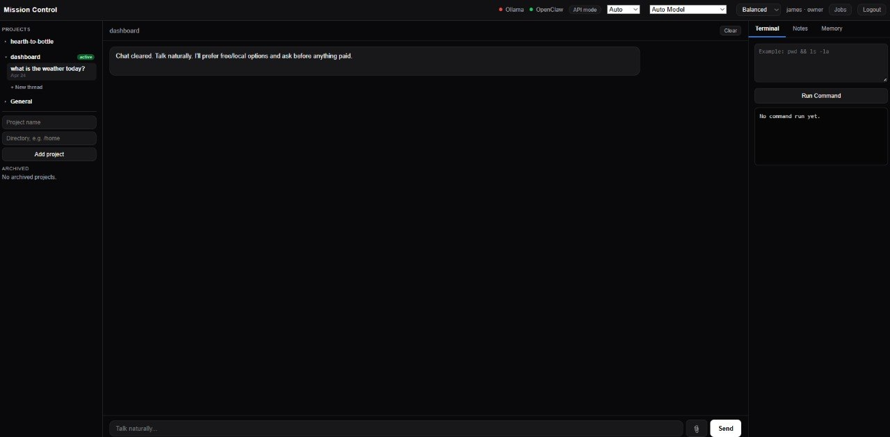

# James Callens — AI Systems & Operations Portfolio

A practical portfolio focused on local-first AI systems, operational tooling, and production-minded execution.

## Who I Am
I build systems that connect AI reasoning with real operational workflows — safely, transparently, and iteratively.

## Core Strengths
- AI-assisted system design and integration
- Full-stack dashboard + API implementation
- Stability/debugging under real runtime constraints
- Security-aware workflow design
- Fast iteration with controlled risk

## Featured Projects

### 1) AI Mission Control Dashboard
A local-first control plane for conversational AI + execution workflows.

- Project page: [`projects/ai-mission-control.md`](./projects/ai-mission-control.md)
- Focus areas: architecture, stability, execution safety, modular growth



### 2) Job Application Pipeline Automation
A structured pipeline for sourcing, scoring, and tracking remote opportunities.

- Project page: [`projects/job-pipeline.md`](./projects/job-pipeline.md)
- Focus areas: fit scoring, priority tiers, follow-up workflow, data hygiene

## Additional Docs
- About: [`docs/ABOUT.md`](./docs/ABOUT.md)
- Architecture snapshot: [`docs/ARCHITECTURE.md`](./docs/ARCHITECTURE.md)
- Project index: [`projects/PROJECT_INDEX.md`](./projects/PROJECT_INDEX.md)

## Hiring Links
- LinkedIn: https://www.linkedin.com/in/james-callens-373a3087/

## Security & Publish Workflow
This repo scaffold includes fail-closed prepublish checks:

```bash
./scripts/prepublish_check.sh
./scripts/make_public_bundle.sh
```

These scripts are designed to help prevent accidental publication of sensitive data.

## Notes
- This is a local-only draft scaffold before public release.
- Final public version should include screenshots, architecture diagrams, and polished project evidence artifacts.

## New Portfolio Uploads (May 2026)

### 3) Workflow Studio
Local-first workflow automation toolkit for orchestrating analysis and operational tasks across scripts, prompts, and process steps.

- Folder: [`workflow-studio/`](./workflow-studio)

### 4) AI Toolkit
Applied AI enablement toolkit with templates, frameworks, and operational guides for safe, practical adoption.

- Folder: [`ai-toolkit/`](./ai-toolkit)

### 5) R Workflow Suite
Reproducible R-based data processing and analysis workflows for structured research and operational reporting.

- Folder: [`r-workflow-suite/`](./r-workflow-suite)

### 6) Weather Dashboard (Desktop, local-first)
Local-first weather planning dashboard focused on actionable day-level decisions using multi-source forecast inputs.

- Folder: [`weather-dashboard/`](./weather-dashboard)

### 7) AI Automation Studio Suite Bundle
Archived bundle of supporting automation artifacts preserved for reference.

- File: [`archives/AI-Automation-Studio-Suite-Bundle.zip`](./archives/AI-Automation-Studio-Suite-Bundle.zip)

### 8) Safe AI Suite
Practical AI safety engineering suite with risk gating, decision traceability, eval harnesses, and publish-safe evidence artifacts.

- Folder: [`safe-ai-suite/`](./safe-ai-suite)
- Highlights: policy controls, eval trend progression, runbooks, failure taxonomy, screenshots

### 9) Ops Insight Copilot (Analyst Workbench)
Local-first analyst workbench that transforms raw support/CRM exports into KPIs, anomaly alerts, prioritized actions, and weekly briefs.

- Folder: [`ops-insight-copilot-analyst-workbench/`](./ops-insight-copilot-analyst-workbench)
- Highlights: multi-format CSV normalization, human-in-the-loop approve/undo, explainable thresholds
