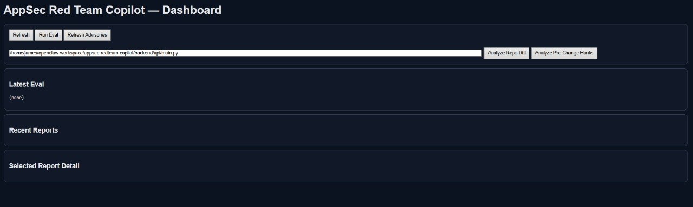
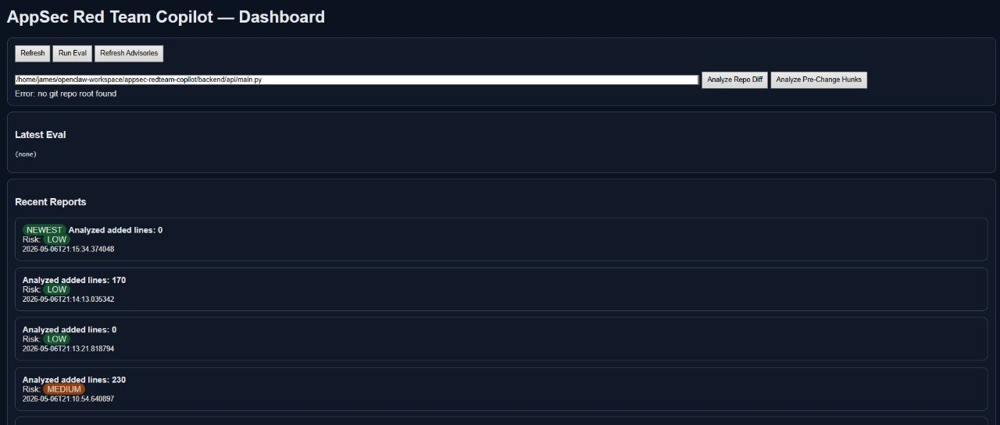

# James Callens — AI Systems & Operations Portfolio

Practical, local-first AI engineering projects focused on real workflows, safety, and production readiness.

## Start Here
- **Flagship:** `appsec-redteam-copilot`
- Portfolio page: [`projects/appsec-redteam-copilot.md`](./projects/appsec-redteam-copilot.md)
- Open this first: [`appsec-redteam-copilot/docs/PORTFOLIO_ONE_PAGER.md`](./appsec-redteam-copilot/docs/PORTFOLIO_ONE_PAGER.md)
- Proof pack: [`appsec-redteam-copilot/release/proof-pack/README.md`](./appsec-redteam-copilot/release/proof-pack/README.md)
- Quick demo path: dashboard -> pre-change verdict -> proof pack -> safety limits


## Featured Projects

- **AppSec Red Team Copilot** — local-first pre-change AppSec triage with verdict gates (`allow/warn/block`), proof-backed safety validation, audit verification, and Dockerized operator workflow.
  - Portfolio page: [`projects/appsec-redteam-copilot.md`](./projects/appsec-redteam-copilot.md)
  - Folder: [`appsec-redteam-copilot/`](./appsec-redteam-copilot)
  - Evidence: [`appsec-redteam-copilot/release/proof-pack/`](./appsec-redteam-copilot/release/proof-pack)

- **LifeOps Copilot** — local-first life/work operations platform (paperwork, planning, approvals, reporting, exports, privacy controls).
  - Folder: [`lifeops-copilot/`](./lifeops-copilot)

- **Ops Insight Copilot (Analyst Workbench)** — analyst workflow system for KPI extraction, anomaly review, and action-oriented weekly briefs.
  - Folder: [`ops-insight-copilot-analyst-workbench/`](./ops-insight-copilot-analyst-workbench)

- **Safe AI Suite** — safety engineering toolkit with risk gating, traceability, and evaluation workflows.
  - Folder: [`safe-ai-suite/`](./safe-ai-suite)

## Additional Projects

- [`ai-toolkit/`](./ai-toolkit)
- [`workflow-studio/`](./workflow-studio)
- [`r-workflow-suite/`](./r-workflow-suite)
- [`weather-dashboard/`](./weather-dashboard)

## Project Pages / Docs

- Project index: [`projects/PROJECT_INDEX.md`](./projects/PROJECT_INDEX.md)
- Mission Control write-up: [`projects/ai-mission-control.md`](./projects/ai-mission-control.md)
- Job pipeline write-up: [`projects/job-pipeline.md`](./projects/job-pipeline.md)
- About: [`docs/ABOUT.md`](./docs/ABOUT.md)
- Architecture snapshot: [`docs/ARCHITECTURE.md`](./docs/ARCHITECTURE.md)

## Security & Publish Workflow

```bash
./scripts/prepublish_check.sh
./scripts/make_public_bundle.sh
```

## Hiring

- LinkedIn: <https://www.linkedin.com/in/james-callens-373a3087/>

## License

This portfolio and included projects are licensed under **AGPL-3.0-only** unless otherwise noted. See `LICENSE` and per-project `NOTICE` files.


## Flagship Preview (AppSec Red Team Copilot)






## 30-Second Demo Script
1. Open dashboard
2. Run pre-change analysis
3. Show verdict + findings
4. Show proof pack validation evidence
5. Explain safety limits clearly

## What this portfolio proves
- I build **governed AI systems**, not wrapper demos
- I use **evals + CI gates** to control quality
- I can operate services with **Docker/systemd**
- I apply **risk controls** and secret hygiene in production-like workflows

## Licensing note
Code is provided for portfolio demonstration and learning under project licenses (AGPL where specified).
