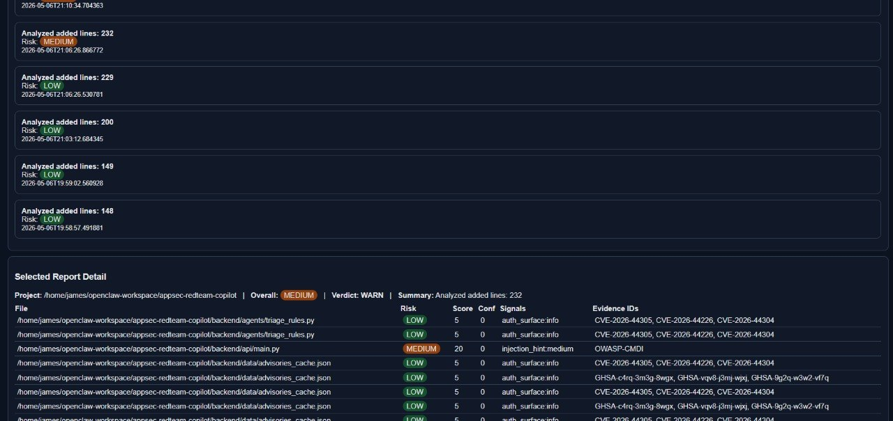

# AppSec Red Team Copilot

Local-first AI safety guard for coding workflows.

## START HERE (explicit install)

### Linux/macOS
1) Clone and enter repo:
```bash
git clone https://github.com/callens-james/appsec-redteam-copilot.git
cd appsec-redteam-copilot
```

2) Preflight check (recommended):
```bash
bash scripts/preflight_check.sh
```

If Docker is missing (Ubuntu):
```bash
sudo apt update
sudo apt install -y docker.io docker-compose-v2
sudo systemctl enable --now docker
sudo usermod -aG docker $USER
newgrp docker
```

3) Start app:
```bash
bash scripts/quickstart.sh
```

> `quickstart.sh` auto-creates `backend/.env.local` on first run.

4) Open dashboard:
- http://127.0.0.1:3480/dashboard
- or server IP from another machine

5) In dashboard, run **First-Run Setup** and select your project/workspace folder.

6) Verify install:
```bash
bash scripts/verify_install.sh
```

### Windows (PowerShell)
```powershell
git clone https://github.com/callens-james/appsec-redteam-copilot.git
cd appsec-redteam-copilot
./scripts/preflight_check.ps1
./scripts/quickstart.ps1
./scripts/verify_install.ps1
```

---

## Quick Self-Test (after quickstart)

Use this to confirm AppSec catches risky changes.

### 1) Create a test folder + file
```bash
mkdir -p ~/appsec-demo-test/backend
cat > ~/appsec-demo-test/backend/test_api.py <<'PY'
def greet(name):
    return f"Hello, {name}"
PY
```

### 2) Add a harmless change (should usually be `allow`)
```bash
echo "# harmless comment" >> ~/appsec-demo-test/backend/test_api.py
```

### 3) Add risky command pattern (should be `warn`/`block`)
```bash
echo "os.system(user_input)" >> ~/appsec-demo-test/backend/test_api.py
```

### 4) Add risky SQL pattern (should be `warn`/`block`)
```bash
echo "query = \"SELECT * FROM users WHERE name='\" + user_input + \"'\"" >> ~/appsec-demo-test/backend/test_api.py
```

### 5) In dashboard, run:
- **Preview Diff/Impact**
- **Analyze Pre-Change Hunks**
- **Analyze Repo Diff**
- **Run Eval**
- **System Check**

Expected:
- benign edit => allow/low
- risky edits => warn/block + findings
- Telegram alerts for warn/block if alert env is configured

---

## What this proves
- AI-assisted **risk gating** with `allow/warn/block`
- **Pre-change** and post-change analysis patterns
- **Eval-driven** quality checks + CI threshold enforcement
- **Operational deployment** (Docker + systemd)
- **Secret hygiene** with local-only environment config

## 30-Second Demo
1. Open `/dashboard`
2. Run pre-change analysis
3. Show verdict + findings
4. Run eval
5. Generate markdown report

## Screenshots




---

## Core Endpoints
- `/dashboard`
- `/analyze-diff-hunks` (pre-change)
- `/analyze-repo-diff` (repo diff)
- `/preview/diff` (impact + line preview)
- `/preview/test-run` (suggested test commands)
- `/eval/run`
- `/advisories/refresh`
- `/reports`

## Optional Telegram Alerts
Create local-only file `backend/.env.local`:
```env
TELEGRAM_BOT_TOKEN=...
TELEGRAM_CHAT_ID=...
ALERT_MIN_VERDICT=warn
```
Then restart:
```bash
docker compose up --build -d
```
Details: `docs/ALERTS_SETUP.md`

## Optional Shell Guard
Quickstart installs shell trap **enabled by default** for interactive shells.
Toggle anytime:
```bash
bash scripts/toggle_shell_trap.sh off
bash scripts/toggle_shell_trap.sh on
bash scripts/toggle_shell_trap.sh status
```
Details: `docs/SHELL_TRAP_SETUP.md`

## Enable on Boot (Linux)
```bash
sudo tee /etc/systemd/system/appsec-copilot.service > /dev/null <<'EOF'
[Unit]
Description=AppSec Red Team Copilot (Docker Compose)
After=docker.service
Requires=docker.service

[Service]
Type=oneshot
WorkingDirectory=<PROJECT_ROOT>
ExecStart=/usr/bin/docker compose up -d
ExecStop=/usr/bin/docker compose down
RemainAfterExit=yes
User=$USER
Group=docker

[Install]
WantedBy=multi-user.target
EOF

sudo systemctl daemon-reload
sudo systemctl enable --now appsec-copilot.service
```

## Installer Hardening Checks
```bash
bash scripts/preflight_check.sh
bash scripts/quickstart.sh
bash scripts/verify_install.sh
```
If Docker permission fails:
```bash
newgrp docker
```

## Developer Notes
- Watcher config: `backend/watchers/watch_config.json`
- Project registry: `backend/watchers/project_registry.json`
- Portability defaults use `/workspace`; users can change paths in dashboard or CLI.

## License
AGPL-3.0-only. See `LICENSE` and `NOTICE`.
