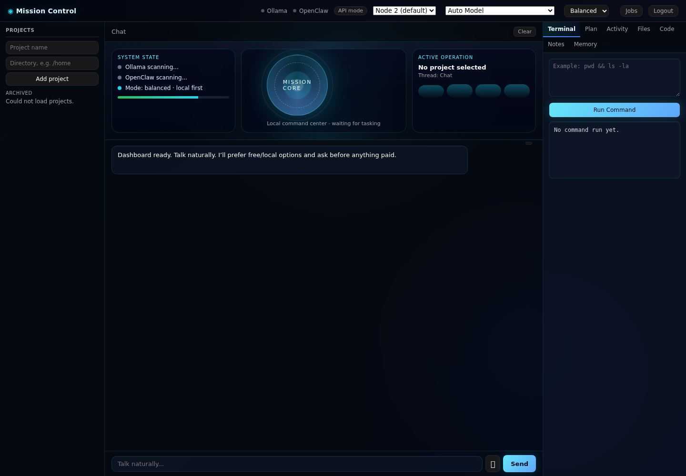

# Featured Project: AI Mission Control Dashboard

## Overview
A local-first AI operations dashboard designed to combine conversational control with practical execution tooling.

## Problem
Most AI tooling is either:
- chat-only with weak execution, or
- terminal-heavy with poor usability.

The goal was to build a mission-control interface that keeps chat natural while preserving operational control.

## What I Built
- Fastify-based backend dashboard service
- Authenticated UI with persistent sessions
- Chat + execution workflow separation
- Job/ops tracking extensions
- Service-based runtime on port 3010
- Local-first model strategy with fallback paths

_Visual proof: updated HUD-style operator cockpit with status signals, active operation context, Mission Core visual layer, activity, files, and code-preview tabs._

## Key Design Decisions
- **Dashboard-first UX**: operator cockpit, not terminal-only
- **Control over automation**: explicit flows over blind execution
- **Modular growth**: add capabilities without breaking stable core
- **Security posture awareness**: prepublish checks, secret-safe handling

## Reliability Wins
- Resolved route/schema drift between frontend and backend
- Removed conflicting runtime/process states
- Stabilized service startup/restart behavior
- Added safer update workflows and verification checks

## Skills Demonstrated
- Full-stack system integration
- API contract and UI alignment
- Incident-style debugging and stabilization
- Security-minded operational discipline
- AI-assisted product iteration

## Stack
- Node.js / Fastify
- Vanilla frontend dashboard
- OpenClaw integration layer
- Linux service/runtime tooling

## Outcome
A usable, extensible local AI control plane that supports real operations and iterative expansion toward a Jarvis-style assistant architecture.
