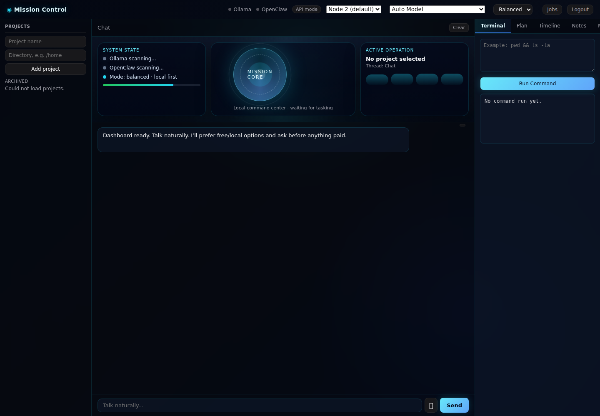
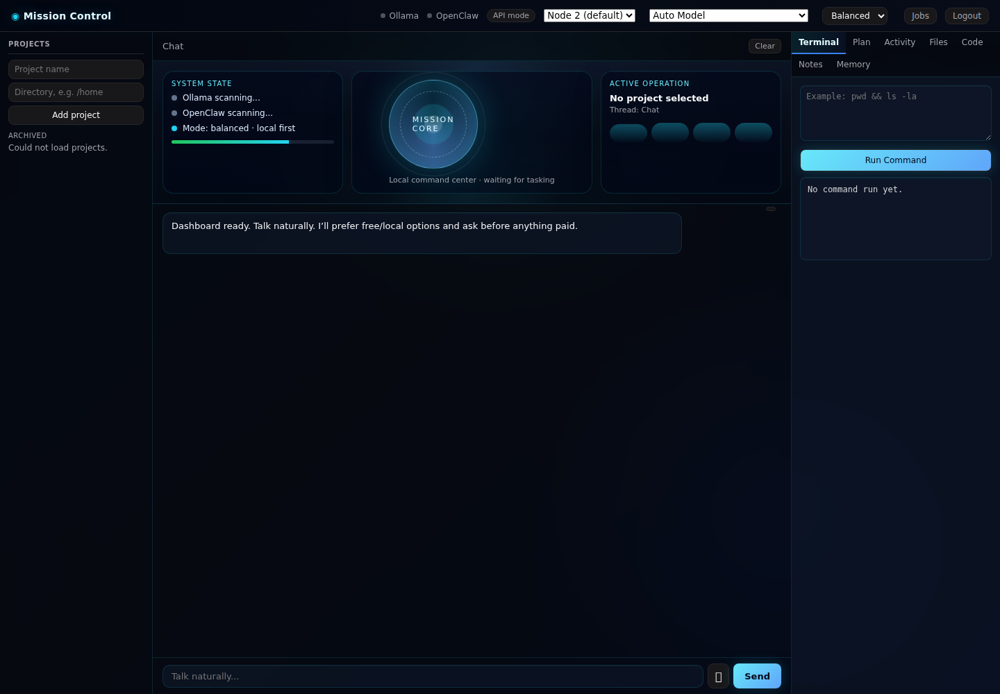

# Featured Project: Mission Control Dashboard

## Overview

Mission Control is a local AI operations dashboard: a private web UI that combines chat, project context, model routing, terminal-style command workflows, file/document review, notes, memory, job tracking, and operational status in one reviewable workspace.

The project is best understood as an internal-style AI operations portal. A user works through a browser dashboard while the backend routes to approved local or remote models, preserves project context, exposes system health, and puts guardrails around tool execution.



## Problem

Most AI tools stop at chat. Real operational use needs more than a prompt box:

- context should persist across projects and threads
- model/tool usage should be visible and intentional
- risky actions should be gated instead of hidden in the background
- local/private runtime state should be separated from public code
- reviewers should be able to understand what the system can and cannot safely do

## What I Built

- Node/Fastify backend with local auth, session handling, health checks, project/thread state, and model-routing endpoints
- Vanilla JavaScript dashboard UI with project sidebar, persistent threads, chat area, status header, mode/model controls, and right-panel tools
- Local-first model routing with explicit orchestration/API escalation path
- Terminal-style command workflow with safety blocking, timeouts, output capture, and follow-up analysis
- Document ingestion support for PDF, DOCX, XLSX, and text files
- Owner-oriented file browser, read-only code preview, browser downloads, notes, memory, and job/application tracking
- Public-readiness checks for syntax, key route presence, ignore hygiene, and obvious secret/private identifier patterns



## Safety / Governance Angle

Mission Control is not framed as autonomous magic. It demonstrates practical human-in-the-loop operations:

- command execution is routed through explicit workflow boundaries
- paid/API escalation is visible and guarded
- local/private runtime state is excluded from public packaging
- validation scripts check route presence, syntax, ignore hygiene, and obvious secret patterns
- the honest product stance is local operator workbench with reviewable controls, not a hosted enterprise SaaS claim

## Portability Notes

The public package is designed to be portable for another operator's personal/local use:

- real `.env` files are excluded
- an example environment file uses placeholder/fill-in configuration
- private runtime JSON state is ignored
- screenshots were audited for private names, secrets, local paths, and IP addresses
- local model and orchestration endpoints are configurable for the operator's own environment

## Tech Stack

- Node.js / Fastify
- Vanilla JavaScript, HTML, and CSS
- Local model routing
- Orchestration/API escalation path
- JSON-backed local runtime state

## Validation Evidence

The public package includes repeatable checks:

```bash
npm run check
npm run validate
npm run scrub:public
```

These checks verify server syntax, expected route presence, ignore hygiene, and common secret/private identifier patterns before publication.

## Honest Boundaries

- Local/private operator dashboard, not a public multi-tenant SaaS product
- Command safety is pragmatic guardrailing, not a hardened sandbox
- Environment integrations depend on the operator's local model/orchestration setup
- Runtime JSON state and `.env` files are private and excluded from public packaging

## Interview Sound Bite

Mission Control is my internal AI operations portal concept. Instead of treating AI as a chatbot, it treats AI as part of an operator workflow: context is preserved, system status is visible, risky actions are gated, and automation can be reviewed before it is trusted.
